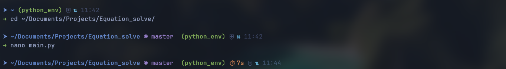

# My Dotfiles

This repository contains my personal configuration files (**dotfiles**) for Linux.

Currently, it includes configurations for:

- Ghostty
- Kitty
- Starship

These files are used to customize my terminal environment and make it more productive and visually appealing.

---

## Repository Structure

```text
dotfiles/
├── ghostty/
├── kitty/
├── starship/
│   ├── starship.toml
│   └── starship-scripts/
│       └── net-status.sh
└── README.md
```

---

## Ghostty

The `ghostty` directory contains my Ghostty terminal configuration, including:

- Main configuration
- Theme files
- Cursor shader effects

Copy it to your Ghostty configuration directory:

```bash
cp -r ghostty ~/.config/
```

---

## Kitty

The `kitty` directory contains:

- `kitty.conf`
- Color themes

Copy it to your Kitty configuration directory:

```bash
cp -r kitty ~/.config/
```

---

## Starship

The `starship` directory contains my custom Starship prompt.

Features include:

- Current directory
- Git branch
- Git status
- Python virtual environment
- Command execution time
- Network status
- Custom icons
- Tokyo Night color scheme

### Custom Script

The prompt uses one custom script:

`starship-scripts/net-status.sh`

This script displays the current network status directly in the prompt.

Make sure it is executable:

```bash
chmod +x starship/starship-scripts/net-status.sh
```

Copy the configuration:

```bash
cp starship/starship.toml ~/.config/
```

---

## Requirements

- Linux
- Ghostty
- Kitty
- Starship
- A Nerd Font (recommended)

---

## Screenshots

Screenshots will be added in the future.

---



## License

This repository is shared for learning and personal use.

Feel free to use it as inspiration for your own terminal setup.
